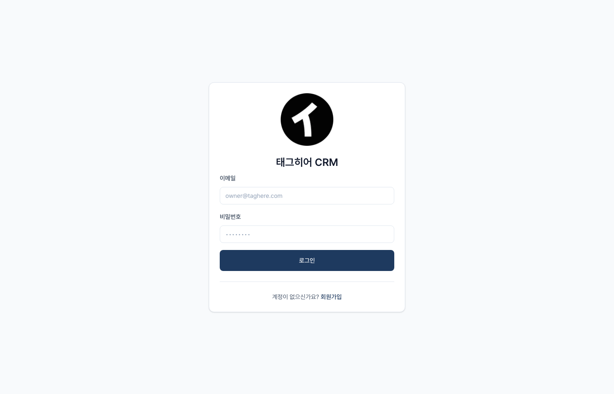
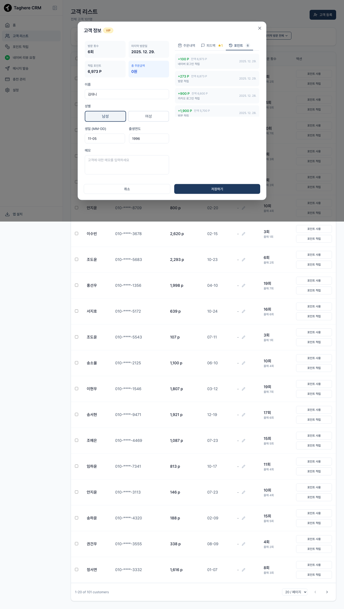
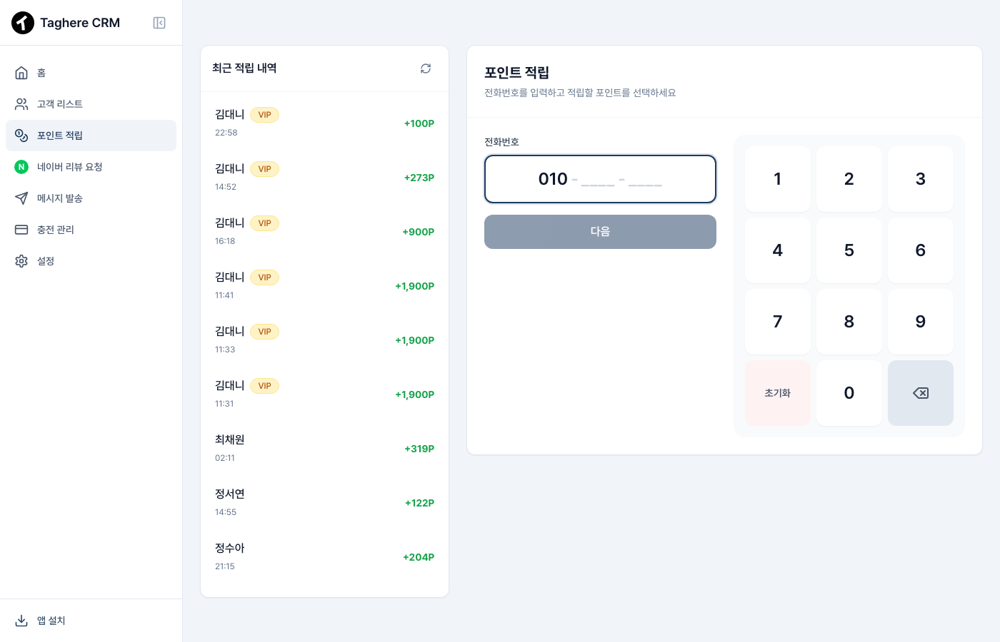
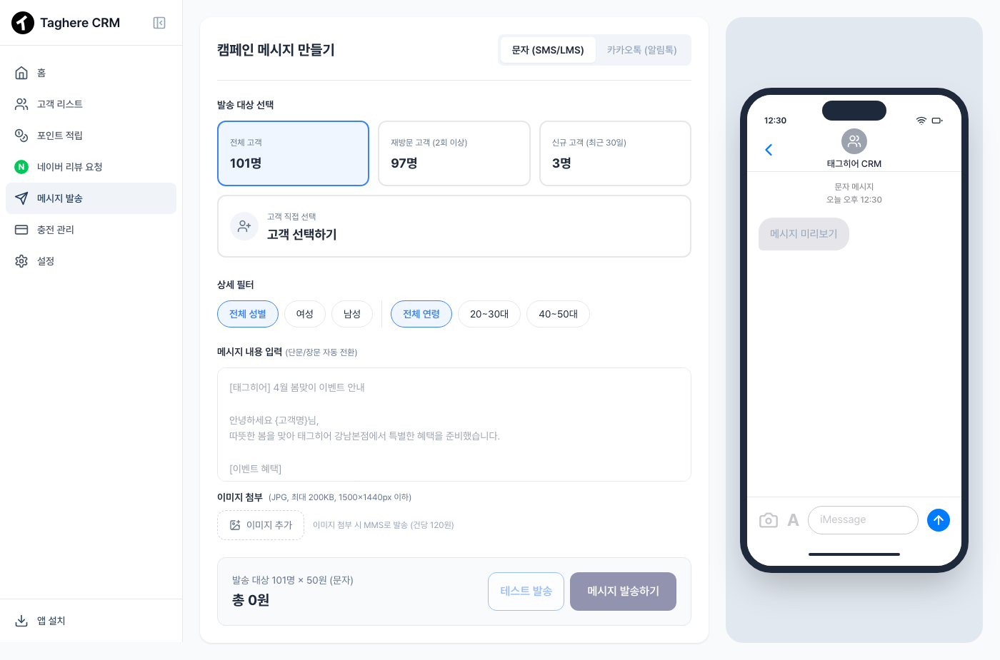
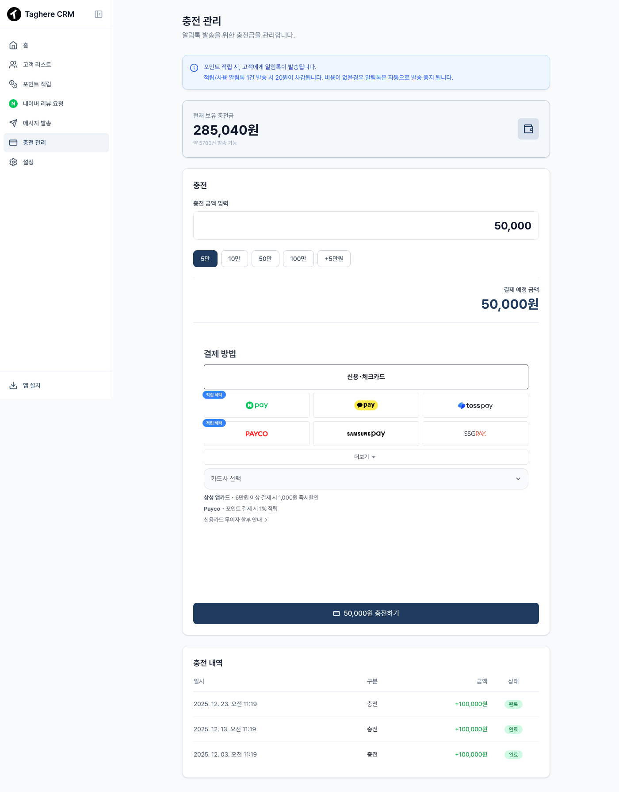

# TagHere CRM 사용자 매뉴얼

---

## 목차

1. [시작하기 - 로그인](#1-시작하기---로그인)
2. [홈 화면 (대시보드)](#2-홈-화면-대시보드)
3. [고객 관리](#3-고객-관리)
4. [포인트 관리](#4-포인트-관리)
5. [메시지 발송](#5-메시지-발송)
6. [설정](#6-설정)
7. [고객의 포인트 적립 과정](#7-고객의-포인트-적립-과정)
8. [요금제 및 결제](#8-요금제-및-결제)
9. [문의 및 지원](#9-문의-및-지원)

---

## 1. 시작하기 - 로그인

TagHere CRM에 접속하여 로그인합니다.

| 번호 | 항목 | 설명 |
|:---:|------|------|
| 1 | 이메일 입력 | 등록된 이메일 주소를 입력합니다 |
| 2 | 비밀번호 입력 | 비밀번호를 입력합니다 |
| 3 | 로그인 버튼 | 클릭하여 로그인합니다 |

---

## 2. 홈 화면 (대시보드)

로그인 후 표시되는 메인 화면입니다. 매장의 주요 지표를 한눈에 확인할 수 있습니다.

| 번호 | 항목 | 설명 |
|:---:|------|------|
| 1 | 사이드바 메뉴 | 각 기능 페이지로 이동합니다 |
| 2 | 총 고객 수 | 등록된 전체 고객 수를 표시합니다 |
| 3 | 신규 등록 고객 | 최근 등록된 신규 고객 수입니다 |
| 4 | 알림톡 발송 가능액 | 충전된 알림톡 잔액을 표시합니다 |
| 5 | 일자별 방문자 수 추이 | 기간별 방문자 추이를 그래프로 보여줍니다 |
| 6 | 오늘 방문자 수 | 오늘 포인트를 적립하거나 신규 등록된 고객 수입니다 |

---

## 3. 고객 관리

### 3.1 고객 목록

등록된 모든 고객을 조회하고 관리할 수 있습니다.

| 번호 | 항목 | 설명 |
|:---:|------|------|
| 1 | 검색 | 고객명 또는 전화번호로 검색합니다 |
| 2 | 필터 | 기간, 등급 등으로 고객을 필터링합니다 |
| 3 | 고객 등록 | 신규 고객을 수동으로 등록합니다 |
| 4 | 고객 목록 | 등록된 고객 정보가 표시됩니다. 클릭하면 상세 정보를 볼 수 있습니다 |

---

### 3.2 고객 상세 정보

고객을 클릭하면 상세 정보 팝업이 표시됩니다.

| 번호 | 항목 | 설명 |
|:---:|------|------|
| 1 | 고객 기본 정보 | 이름, 연락처, 등급, 가입일 등 |
| 2 | 보유 포인트 | 고객의 현재 보유 포인트 |
| 3 | 주문 내역 탭 | 고객의 주문 이력을 확인합니다 |
| 4 | 포인트 사용 버튼 | 고객의 포인트를 차감합니다 |
| 5 | 포인트 적립 버튼 | 고객에게 포인트를 적립합니다 |

---

### 3.3 피드백 탭

고객이 남긴 평점과 피드백을 확인할 수 있습니다.

| 번호 | 항목 | 설명 |
|:---:|------|------|
| 1 | 피드백 탭 | 클릭하여 피드백 내역을 확인합니다 |
| 2 | 피드백 내역 | 고객이 남긴 별점과 의견이 표시됩니다 |

---

### 3.4 포인트 내역 탭

고객의 포인트 적립 및 사용 내역을 확인합니다.

| 번호 | 항목 | 설명 |
|:---:|------|------|
| 1 | 포인트 탭 | 클릭하여 포인트 이력을 확인합니다 |
| 2 | 포인트 내역 | 적립/사용 날짜, 금액, 사유가 표시됩니다 |

---

## 4. 포인트 관리

전체 포인트 적립 및 사용 내역을 조회하고, 고객에게 포인트를 적립할 수 있습니다.

| 번호 | 항목 | 설명 |
|:---:|------|------|
| 1 | 최근 적립 내역 | 최근 포인트 적립 내역이 표시됩니다 |
| 2 | 포인트 적립 | 전화번호를 입력하여 고객에게 포인트를 적립합니다 |

---

## 5. 메시지 발송

알림톡을 통해 고객에게 메시지를 발송합니다.

| 번호 | 항목 | 설명 |
|:---:|------|------|
| 1 | 발송 대상 선택 | 전체 고객, 활성 고객, 신규 고객 중 선택합니다 |
| 2 | 상세 필터 | 성별, 연령대 등으로 대상을 세분화합니다 |
| 3 | 메시지 내용 입력 | 발송할 메시지 내용을 작성합니다 |
| 4 | 메시지 미리보기 | 실제 발송될 메시지 형태를 미리 확인합니다 |
| 5 | 발송 버튼 | 테스트 발송 또는 실제 발송을 진행합니다 |

---

## 6. 설정

매장 정보 및 서비스 설정을 관리합니다.

| 번호 | 항목 | 설명 |
|:---:|------|------|
| 1 | 매장 정보 | 매장명, 연락처, 주소, 태그히어 슬러그 등을 설정합니다 |
| 2 | 고객 등록 링크 | QR 코드를 통해 고객이 직접 등록할 수 있는 링크입니다 |
| 3 | 알림톡 설정 | 포인트 적립/사용 시 자동 발송 알림톡을 설정합니다 |
| 4 | 포인트 적립률 | 결제 금액 대비 적립률(%)을 설정합니다 |
| 5 | 계정 관리 | 로그아웃 등 계정 관련 기능입니다 |

---

## 7. 고객의 포인트 적립 과정

고객이 매장에서 주문 후 포인트를 적립하는 과정입니다.

### 7.1 포인트 적립 화면

고객이 주문 완료 후 영수증의 QR 코드를 스캔하면 아래 화면이 표시됩니다.

> **화면 구성**
> - 상단: 적립될 포인트 안내 (주문 금액 x 적립률)
> - 중앙: 포인트 코인 이미지 (탭하면 카카오 로그인으로 이동)
> - 하단: "포인트 적립하기" 버튼

**적립 과정:**
1. 고객이 QR 코드를 스캔합니다
2. 적립될 포인트가 표시됩니다
3. "포인트 적립하기" 버튼 또는 코인 이미지를 탭합니다
4. 카카오 로그인을 진행합니다
5. 포인트가 자동으로 적립됩니다

---

### 7.2 적립 완료 화면

카카오 로그인 후 포인트가 적립되면 완료 화면이 표시됩니다.

| 번호 | 항목 | 설명 |
|:---:|------|------|
| 1 | 적립 완료 메시지 | 포인트 적립이 완료되었음을 안내합니다 |
| 2 | 매장명 | 포인트가 적립된 매장 이름입니다 |
| 3 | 적립된 포인트 | 실제로 적립된 포인트가 표시됩니다 |
| 4 | 안내 메시지 | 알림톡 확인 및 다음 방문 시 사용 안내입니다 |

---

## 8. 요금제 및 결제

서비스 이용을 위한 알림톡 발송 금액을 충전합니다.

| 번호 | 항목 | 설명 |
|:---:|------|------|
| 1 | 현재 잔액 | 현재 충전된 알림톡 발송 가능 금액입니다 |
| 2 | 충전 금액 선택 | 충전할 금액을 선택합니다 (50건, 100건, 500건 등) |
| 3 | 결제 방법 | 신용/체크카드, 간편결제 등을 선택합니다 |
| 4 | 충전하기 버튼 | 결제를 진행합니다 |
| 5 | 충전 내역 | 이전 충전 내역을 확인합니다 |

---

## 9. 문의 및 지원

서비스 이용 중 문의사항이 있으시면 아래로 연락해 주세요.

---

### 고객센터

**070-4138-0263**

---

*TagHere CRM 사용자 매뉴얼 v1.0*
